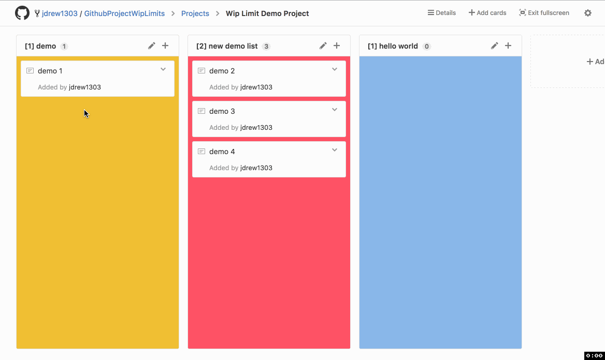
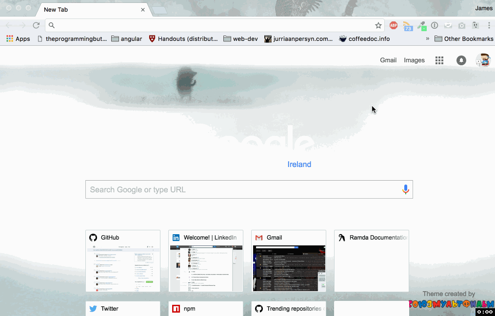

  

  <b><a href="#overview">Overview</a></b>
  |
  <b><a href="#features">Features</a></b>
  |
  <b><a href="#credits">Credits</a></b>
  |
  <b><a href="#issues">Issues</a></b>

    
    
    
    

## Overview

  

<a href="#top">:arrow_up:</a>

## Installation 

## Features

<a href="#top">:arrow_up:</a>

## Credits

Copyright (c) 2016

<a href="#top">:arrow_up:</a>
